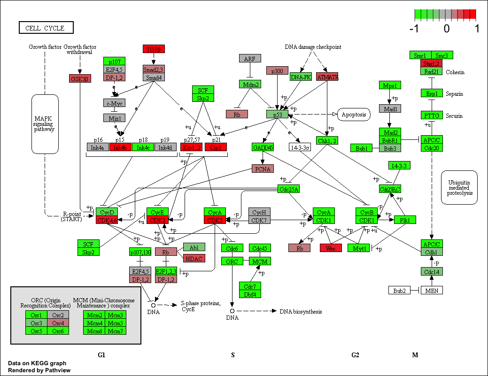

```{r setup, include=FALSE}
knitr::opts_chunk$set(echo = TRUE)
```

## Differential Expression Analysis

```{r}
library(DESeq2)
```

```{r}
metaFile <- "data/GSE37704_metadata.csv"
countFile <- "data/GSE37704_featurecounts.csv"

# Import metadata and take a peak (colData = tells to seek columns)
colData = read.csv(metaFile, row.names=1)
head(colData)
```


```{r}
# Import countdata
countData = read.csv(countFile, row.names=1)
head(countData)
```

Remove the first 'length' col from the 'countData' data.frame

```{r}
# Note we need to remove the odd first $length col
countData <- as.matrix(countData[,-1])
head(countData)
```

This looks better but there are lots of zero entries in there so let’s get rid of them as we have no data for these.

```{r}
# Filter count data where you have 0 read count across all samples.
countData = countData[rowSums(countData)>1, ]
head(countData)
```


Lets setup the DESeqDataSet object required for the DESeq() function and then run the DESeq pipeline. This is again similar to our last days hands-on session.

```{r}
dds = DESeqDataSetFromMatrix(countData=countData,
                             colData=colData,
                             design=~condition)
```


```{r}
dds = DESeq(dds)
```


```{r}
dds
```


Next, get results for the HoxA1 knockdown versus control siRNA (remember we labeled these as “hoxa1_kd” and “control_sirna” in our original colData metaFile input to DESeq, you can check this above and by running


```{r}
resultsNames(dds)
```


```{r}
res = results(dds, contrast=c("condition", "hoxa1_kd", "control_sirna"))

```


Let’s reorder these results by p-value and call summary() on the results object to get a sense of how many genes are up or down-regulated at the default FDR of 0.1.


```{r}
res = res[order(res$pvalue),]
summary(res)
```


Since we mapped and counted against the Ensembl annotation, our results only have information about Ensembl gene IDs. However, our pathway analysis downstream will use KEGG pathways, and genes in KEGG pathways are annotated with Entrez gene IDs. So lets add them as we did the last day.

```{r}
library("AnnotationDbi")
library("org.Hs.eg.db")

columns(org.Hs.eg.db)
```

```{r}
res$symbol = mapIds(org.Hs.eg.db,
                    keys=row.names(res), 
                    column="SYMBOL",
                    keytype="ENSEMBL",
                    multiVals="first")

res$entrez = mapIds(org.Hs.eg.db,
                    keys=row.names(res), 
                    column="ENTREZID",
                    keytype="ENSEMBL",
                    multiVals="first")

res$name =   mapIds(org.Hs.eg.db,
                    keys=row.names(res), 
                    column="GENENAME",
                    keytype="ENSEMBL",
                    multiVals="first")

head(res, 10)
```

Now lets see how pathway analysis can help us make further sense out of this ranked list of differentially expressed genes.

## Pathway Analysis

Here we are going to use the gage package for pathway analysis. Once we have a list of enriched pathways, we’re going to use the pathview package to draw pathway diagrams, shading the molecules in the pathway by their degree of up/down-regulation.

### KEG

```{r}
#source("http://bioconductor.org/biocLite.R")
#biocLite( c("pathview", "gage", "gageData") )
```

```{r}
library(pathview)
library(gage)
library(gageData)
```

```{r}
data(kegg.sets.hs)
data(sigmet.idx.hs)

kegg.sets.hs = kegg.sets.hs[sigmet.idx.hs]
head(kegg.sets.hs, 3)
```

The main gage() function requires a named vector of fold changes, where the names of the values are the Entrez gene IDs.

```{r}
foldchanges = res$log2FoldChange
names(foldchanges) = res$entrez
head(foldchanges)
```

Now, let’s run the pathway analysis. See help on the gage function with ?gage. Specifically, you might want to try changing the value of same.dir. This value determines whether to test for changes in a gene set toward a single direction (all genes up or down regulated) or changes towards both directions simultaneously (i.e. any genes in the pathway dysregulated).

Here, we’re using same.dir=TRUE, which will give us separate lists for pathways that are upregulated versus pathways that are down-regulated. Let’s look at the first few results from each.

```{r}
# Get the results
keggres = gage(foldchanges, gsets=kegg.sets.hs, same.dir=TRUE)
```

Lets look at the result object. It is a list with three elements (“greater”, “less” and “stats”).

```{r}
attributes(keggres)
```

So it is a list object (you can check it with str(keggres)) and we can use the dollar syntax to access a named element, e.g.

```{r}
head(keggres$greater)
```

```{r}
head(keggres$less)
```

Each keggres$greater and keggres$less object is data matrix with gene sets as rows sorted by p-value. Lets look at both up (greater), down (less), and statistics by calling head() with the lapply() function. As always if you want to find out more about a particular function or its return values use the R help system (e.g. ?gage or ?lapply).

```{r}
lapply(keggres, head)
```

Now, let’s process the results to pull out the top 5 upregulated pathways, then further process that just to get the IDs. We’ll use these KEGG pathway IDs downstream for plotting.

```{r}
## Sanity check displaying all pathways data
pathways = data.frame(id=rownames(keggres$greater), keggres$greater)
head(pathways)
```

Now, let’s try out the pathview() function from the pathview package to make a pathway plot with our result shown in color. To begin with lets manually supply a pathway.id (namely the first part of the "hsa04110 Cell cycle") that we could see from the print out above.

```{r}
pathview(gene.data=foldchanges, pathway.id="hsa04110")
```

This downloads the patway figure data from KEGG and adds our results to it. You can play with the other input arguments to pathview() to change the dispay in various ways including generating a PDF graph. For example:

```{r}
# A different PDF based output of the same data
pathview(gene.data=foldchanges, pathway.id="hsa04110", kegg.native=FALSE)
```

Here is the default low resolution raster PNG output from the first pathview() call above

 

Note how many of the genes in this pathway are pertubed (i.e. colored) in our results.

Now, let’s process our results a bit more to automagicaly pull out the top 5 upregulated pathways, then further process that just to get the IDs needed by the pathview() function. We’ll use these KEGG pathway IDs for plotting below.

```{r}
## Focus on top 5 upregulated pathways here for demo purposes only
keggrespathways <- rownames(keggres$greater)[1:5]
```

```{r}
# Extract the IDs part of each string
keggresids = substr(keggrespathways, start=1, stop=8)
keggresids
```

Finally, lets pass these IDs in keggresids to the pathview() function to draw plots for all the top 5 pathways.

```{r}
pathview(gene.data=foldchanges, pathway.id=keggresids, species="hsa")
```


 

 

 

 

## Gene Ontology

Can also do similar procedure with gene ontology. Similar to above, go.sets.hs has all GO terms. go.subs.hs is a names list containing indexes for the BP, CC, anf MF ontoogies. Lets only do Biological Process. 

```{r}
data(go.sets.hs)
data(go.subs.hs)
gobpsets = go.sets.hs[go.subs.hs$BP]

gobpres = gage(foldchanges, gsets=gobpsets, same.dir = TRUE)

lapply(gobpres,head)
```

## Reactome Pathway Analysis Online

Reactome --> R package. Reactome is database consisting of biological molecules and their relation to pathways and processes. Reactome, such as many other tools, has an online software available (https://reactome.org/) and R package available (https://bioconductor.org/packages/release/bioc/html/ReactomePA.html).

If you would like more information, the documentation is available here: https://reactome.org/user/guide

Let’s now conduct over-representation enrichment analysis and pathway-topology analysis with Reactome using the previous list of significant genes generated from our differential expression results above.

First, Using R, output the list of significant genes at the 0.05 level as a plain text file:

```{r}
sig_genes <- res[res$padj <= 0.05 & !is.na(res$padj), "symbol"]

print(paste("Total number of significant genes:", length(sig_genes)))
```

```{r}
write.table(sig_genes, file="significant_genes.txt", row.names=FALSE, col.names=FALSE, quote=FALSE)
```

Then, to perform pathway analysis online go to the Reactome website (https://reactome.org/PathwayBrowser/#TOOL=AT). Select “choose file” to upload your significant gene list. Then, select the parameters “Project to Humans”, then click “Analyze”.

## Go Analysis 

Gene Set Gene Ontology (GO) Enrichment is a method to determine over-represented or under-represented GO terms for a given set of genes. GO terms are formal structured controlled vocabularies (ontologies) for gene products in terms of their biological function. The goal of this analysis is to determine the biological process the given set of genes are associated with.

To perform Gene Set GO Enrichment online go to the website http://www.geneontology.org/page/go-enrichment-analysis. Paste your significant gene list from section 4. Then, select “biological process” and “homo sapiens”, and click submit.


```{r}
sessionInfo()
```


